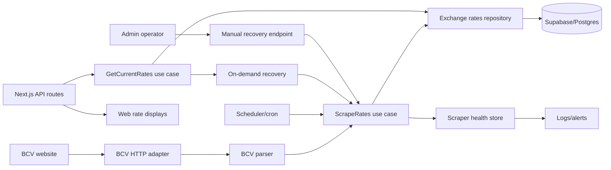

# Architecture: Rates Scraper Recovery

## Decision

Use a hexagonal scraper architecture: domain rules decide freshness and usability; adapters handle BCV HTTP, parsing, Supabase persistence, scheduling, API routes, UI, and alerting.

Goal: no stale/fallback exchange rate can look fresh or authoritative.

## Source PRD

- PRD: `docs/prd-rates-scraper-recovery.md`
- Prior targeted fix: `openspec/changes/fix-rates-scraper-fallback/`

## Architecture principles

| Principle               | Rule                                                                                        |
| ----------------------- | ------------------------------------------------------------------------------------------- |
| Dependency inward       | Domain freshness rules do not import Next.js, Supabase, logger, or scraper implementations. |
| Explicit degraded state | `fresh`, `stale`, `fallback`, and `unavailable` are first-class states.                     |
| One scheduler owner     | Production has one scrape trigger path with locking/idempotency.                            |
| Fail loudly             | Parser, DB write, scheduler, and alert failures become health metadata.                     |
| Bounded recovery        | API/manual recovery can try one scrape, with timeout/rate-limit/circuit-breaker controls.   |
| Financial safety        | Fallback rates never drive authoritative conversion without warning/blocking policy.        |

## System context



## Layer model

```text
Domain
  RateSnapshot
  RateFreshness
  ScrapeAttempt
  FreshnessPolicy
  RateUsabilityPolicy

Application use cases
  GetCurrentRates
  ScrapeAndPersistRates
  TriggerManualRatesRecovery
  ReportScraperHealth
  EvaluateRatesFreshness

Ports
  RatesRepository
  RateHistoryRepository
  BCVSourceClient
  RatesParser
  ScraperLock
  ScraperMetrics
  AlertSink
  AuditLog
  Clock

Adapters
  BCV HTTP fetcher/parser
  Supabase repositories
  Next.js API routes
  Scheduler/cron entrypoint
  UI rate components/hooks
  Logger/alert provider
```

Dependencies point inward: adapters implement ports; use cases depend on ports and domain objects.

## Domain model

### `RateSnapshot`

Represents usable rate data.

| Field          | Type                           | Notes                                               |
| -------------- | ------------------------------ | --------------------------------------------------- |
| `baseCurrency` | `'VES'`                        | BCV baseline.                                       |
| `rates`        | `{ USD: number; EUR: number }` | Must include both USD and EUR for valid BCV scrape. |
| `source`       | `'database' \| 'live-scrape'`  | Source of usable data.                              |
| `timestamp`    | ISO datetime                   | Data timestamp, not response timestamp.             |
| `ageMinutes`   | integer                        | Derived from `Clock`.                               |

### `RateFreshness`

Classifies current data.

| State           | Condition                    | Product behavior                       |
| --------------- | ---------------------------- | -------------------------------------- |
| `fresh`         | `age <= 24h`                 | Normal display.                        |
| `stale-warning` | `24h < age <= 48h`           | Warning badge + degraded health.       |
| `incident`      | `48h < age <= 7d`            | Alert + strong warning.                |
| `hard-failure`  | `age > 7d` or no usable rate | Block authoritative conversion claims. |

### `ScrapeAttempt`

Records one scrape execution.

| Field                      | Notes                                                             |
| -------------------------- | ----------------------------------------------------------------- |
| `attemptId`                | Correlation ID for logs/audit.                                    |
| `trigger`                  | `scheduled`, `on-demand`, or `manual`.                            |
| `stage`                    | `scheduled`, `fetch`, `parse`, `validate`, `persist`, `complete`. |
| `status`                   | `success`, `failed`, `skipped`, `blocked`.                        |
| `failureReason`            | Machine-readable reason.                                          |
| `startedAt` / `finishedAt` | Timing and SLA evidence.                                          |
| `extractedCurrencies`      | e.g. `['USD', 'EUR']`.                                            |

## Use cases

### 1. `GetCurrentRates`

Primary read path for `/api/bcv-rates` and UI consumers.

Flow:

1. Read latest BCV snapshot from `RatesRepository`.
2. Classify freshness with `FreshnessPolicy`.
3. If data is fresh/stale but usable, return snapshot with metadata.
4. If data missing or hard-stale, optionally call `ScrapeAndPersistRates` once as on-demand recovery.
5. Return strict response:
   - usable data: `success: true`, explicit freshness metadata.
   - unavailable data: non-2xx, `success: false`, `fallback/unavailable` metadata.

### 2. `ScrapeAndPersistRates`

Single scrape pipeline used by scheduler, on-demand API recovery, and manual recovery.

Flow:

1. Acquire `ScraperLock` for BCV.
2. Check circuit breaker and rate-limit policy.
3. Fetch BCV page with timeout.
4. Parse USD/EUR containers.
5. Validate both USD and EUR are present and numeric.
6. Persist latest snapshot and history atomically.
7. Record `ScrapeAttempt` success/failure.
8. Emit metrics/logs and alert if threshold crossed.
9. Release lock.

### 3. `ReportScraperHealth`

Produces operator and health endpoint view.

Returns:

- last successful scrape.
- last failed scrape.
- failure count/window.
- current freshness band.
- scheduler heartbeat.
- circuit breaker state.
- lock state.
- source URL.
- likely failure stage.

### 4. `TriggerManualRatesRecovery`

Admin-only recovery path.

Rules:

- Requires admin/service authorization.
- Creates audit event before/after execution.
- Can bypass scheduler timing, not parser validation.
- May override circuit breaker only with explicit admin flag and audit reason.
- Returns parse/persist/health result.

## Ports

| Port                    | Responsibility                                  |
| ----------------------- | ----------------------------------------------- |
| `RatesRepository`       | Read/write latest BCV snapshot.                 |
| `RateHistoryRepository` | Append historical rate record.                  |
| `BCVSourceClient`       | Fetch raw BCV HTML/response.                    |
| `RatesParser`           | Extract USD/EUR from raw source.                |
| `ScraperLock`           | Prevent duplicate production scraping.          |
| `ScraperMetrics`        | Emit counters, timings, freshness gauges.       |
| `AlertSink`             | Notify incident channel when thresholds breach. |
| `AuditLog`              | Record manual recovery attempts.                |
| `Clock`                 | Deterministic time for tests.                   |

## Adapters

| Adapter             | Existing/target files                                                                                                                                   |
| ------------------- | ------------------------------------------------------------------------------------------------------------------------------------------------------- |
| BCV parser          | `lib/scrapers/bcv-scraper.ts`, `lib/scrapers/parsers/number.ts`                                                                                         |
| Scraper controls    | `lib/scrapers/circuit-breaker.ts`, `lib/scrapers/retry-handler.ts`, `lib/scrapers/metrics.ts`                                                           |
| Background services | `lib/services/background-scraper.ts`, `lib/services/background-scraper-manager.ts`, `lib/services/exchange-rate-sync-job.ts`                            |
| Persistence         | `lib/services/exchange-rate-db.ts`, `repositories/supabase/exchange-rates-repository-impl.ts`, `repositories/supabase/rates-history-repository-impl.ts` |
| API read path       | `app/api/bcv-rates/route.ts`                                                                                                                            |
| Health API          | `app/api/scrapers/health/route.ts`                                                                                                                      |
| Manual recovery API | `app/api/admin/rates/recover/route.ts` (proposed)                                                                                                       |
| UI consumers        | `hooks/use-bcv-rates.ts`, `components/currency/bcv-rates.tsx`, `components/exchange-rate-display.tsx`, `app/(public)/components/live-rates-section.tsx` |

## API contracts

### `GET /api/bcv-rates`

Read current rates. May perform one bounded on-demand scrape only when data is missing or hard-stale and policy allows.

Success response:

```json
{
  "success": true,
  "rates": { "USD": 36.5, "EUR": 39.2 },
  "source": "database",
  "timestamp": "2026-05-22T12:00:00.000Z",
  "ageMinutes": 20,
  "freshness": "fresh",
  "fallback": false,
  "stale": false,
  "fromLiveScrape": false
}
```

Unavailable response:

```json
{
  "success": false,
  "source": "unavailable",
  "fallback": true,
  "stale": true,
  "freshness": "hard-failure",
  "fallbackReason": "live_scrape_failed",
  "lastKnownTimestamp": "2026-04-15T12:00:00.000Z"
}
```

### `GET /api/scrapers/health`

Operator health payload.

```json
{
  "bcv": {
    "status": "degraded",
    "freshness": "incident",
    "lastSuccessAt": "2026-05-20T12:00:00.000Z",
    "lastFailureAt": "2026-05-22T12:00:00.000Z",
    "lastFailureStage": "parse",
    "failureCount24h": 12,
    "schedulerHeartbeatAt": "2026-05-22T12:05:00.000Z",
    "circuitBreaker": "closed",
    "locked": false,
    "sourceUrl": "https://www.bcv.org.ve/"
  }
}
```

### `POST /api/admin/rates/recover`

Admin-only manual recovery.

Request:

```json
{
  "provider": "bcv",
  "reason": "Rates stale after alert",
  "overrideCircuitBreaker": false
}
```

Response:

```json
{
  "success": true,
  "attemptId": "rate_attempt_123",
  "trigger": "manual",
  "extractedCurrencies": ["USD", "EUR"],
  "persisted": true,
  "freshness": "fresh",
  "nextScheduledRunAt": "2026-05-22T13:00:00.000Z"
}
```

## Persistence design

### Existing tables/repositories

Use existing exchange-rate repositories where possible:

- latest/current exchange rates.
- rates history.

### Needed fields

If missing from current schema, add equivalent fields through migration or health-side storage:

| Field              | Purpose                          |
| ------------------ | -------------------------------- |
| `provider`         | `bcv`, future providers.         |
| `base_currency`    | `VES`.                           |
| `rates`            | JSON or normalized USD/EUR rows. |
| `source_timestamp` | Data timestamp.                  |
| `scraped_at`       | System scrape timestamp.         |
| `source_url`       | Debug source.                    |
| `attempt_id`       | Traceability to scrape attempt.  |

### Scrape attempts table/view

Recommended: persist attempts for diagnosis.

| Field                        | Purpose                                            |
| ---------------------------- | -------------------------------------------------- |
| `id`                         | Attempt ID.                                        |
| `provider`                   | `bcv`.                                             |
| `trigger`                    | scheduled/on-demand/manual.                        |
| `status`                     | success/failed/skipped/blocked.                    |
| `stage`                      | failure location.                                  |
| `failure_reason`             | machine-readable reason.                           |
| `started_at` / `finished_at` | timing.                                            |
| `metadata`                   | extracted currencies, HTTP status, parser version. |

RLS/security:

- Public users do not read attempt internals.
- Admin/service role can read attempts.
- Manual recovery writes audit record.

## Scheduling and locking

Preferred production shape:

```text
External cron or platform scheduler
  -> protected scheduler endpoint / job handler
    -> ScrapeAndPersistRates(trigger: scheduled)
      -> distributed lock
      -> scrape pipeline
```

Rules:

- One scheduler owner documented in env/runbook.
- Lock TTL shorter than scrape interval; stale locks expire safely.
- Scheduler heartbeat updates even when scrape skipped by lock/circuit breaker.
- Duplicate calls return `skipped_locked`, not parallel scrapes.

## Failure-stage taxonomy

| Stage             | Example reason       | Action                              |
| ----------------- | -------------------- | ----------------------------------- |
| `scheduler`       | no heartbeat         | Fix cron/platform job.              |
| `fetch`           | timeout, DNS, 403    | Check BCV availability/network.     |
| `parse`           | selectors changed    | Update parser/fixtures.             |
| `validate`        | USD or EUR missing   | Treat as failed scrape.             |
| `persist`         | Supabase write error | Check DB/schema/service role.       |
| `circuit-breaker` | repeated failures    | Inspect root cause before override. |
| `rate-limit`      | too many attempts    | Wait or manual override with audit. |

## Alerting

Emit metrics:

| Metric                                         | Type    |
| ---------------------------------------------- | ------- |
| `rates_bcv_age_minutes`                        | gauge   |
| `rates_bcv_scrape_success_total`               | counter |
| `rates_bcv_scrape_failure_total{stage,reason}` | counter |
| `rates_bcv_fallback_response_total`            | counter |
| `rates_bcv_scheduler_heartbeat_age_minutes`    | gauge   |

Alert rules:

1. `rates_bcv_age_minutes > 2880` (48h) => incident alert.
2. scheduler heartbeat missing beyond 2 intervals => scheduler alert.
3. parse failures > 3 consecutive => parser alert.
4. fallback responses > 0 for strict endpoints => high-priority warning.

## UI contract

UI consumes freshness metadata; no component infers freshness from timestamp alone.

| Freshness       | UI behavior                                              |
| --------------- | -------------------------------------------------------- |
| `fresh`         | Normal display with timestamp.                           |
| `stale-warning` | Badge: “Tasa desactualizada”.                            |
| `incident`      | Strong warning; support-safe copy.                       |
| `hard-failure`  | Block authoritative conversion claim; show outage state. |
| `unavailable`   | Empty state, retry later, no official/current claim.     |

## Security

- Manual recovery endpoint admin-only.
- Scheduler endpoint protected by service token or platform secret.
- Service-role DB access stays server-only.
- Audit log records actor, reason, trigger, override flag, result.
- No user-supplied URL for scraper source.

## Test architecture

| Test type              | Coverage                                                          |
| ---------------------- | ----------------------------------------------------------------- |
| Domain unit            | freshness threshold boundaries; usability policy.                 |
| Parser unit            | USD/EUR extraction; partial extraction failure; mutated fixtures. |
| Use-case unit          | lock, circuit breaker, retry, failure-stage mapping.              |
| API node               | success, stale, hard-failure, unavailable, on-demand recovery.    |
| Repository integration | latest + history writes; attempt record writes.                   |
| Scheduler integration  | heartbeat, duplicate lock, skipped/rate-limited states.           |
| UI component           | badges, outage copy, conversion blocking.                         |
| Live smoke             | opt-in BCV scrape validates current structure.                    |

Strict regression cases:

- Static fallback never returns `success: true` as fresh.
- Partial USD-only or EUR-only scrape fails validation.
- DB empty + live scrape fails => non-2xx strict response.
- DB hard-stale + live scrape succeeds => `fromLiveScrape: true`.
- > 48h stale => alert metadata present.

## Implementation sequence

1. Extract `FreshnessPolicy` and shared response types.
2. Add scrape attempt model and health aggregation.
3. Harden `ScrapeAndPersistRates` use case behind ports.
4. Wire scheduler through same use case.
5. Extend `/api/bcv-rates` and `/api/scrapers/health`.
6. Add admin recovery endpoint.
7. Add UI stale/fallback states.
8. Add alert rule and runbook.

## Review checklist

- [ ] Domain has no Next.js/Supabase imports.
- [ ] Parser requires USD and EUR.
- [ ] API contract exposes `freshness`, `ageMinutes`, `fallback`, `stale`, and `source`.
- [ ] One production scheduler owner documented.
- [ ] Lock prevents duplicate scrapes.
- [ ] Health endpoint identifies failure stage.
- [ ] Alert fires before 48h stale state becomes invisible.
- [ ] Manual recovery is authenticated and audited.
- [ ] UI never labels fallback as official/current.
