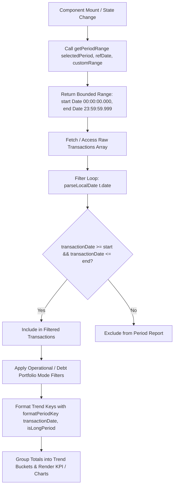

# Technical Design: Fix Annual Report Date Period Boundaries and Timezone Handling

## 1. Architecture Decisions

### 1.1 Centralization of Period Boundaries & Date Handling
Currently, date boundary calculations for reports are scattered and incomplete:
* `desktop-reports.tsx` and `mobile-reports.tsx` define local helper `getPeriodStartDate` returning start dates, but use an unbounded maximum timestamp (`new Date(8640000000000000)`) for non-custom periods. This allows future transactions or entries past the target period boundary (e.g. next year's transactions in an annual report) to spill into report calculations.
* Date string parsing relies on standard `new Date(dateString)` constructor calls, which interpret `YYYY-MM-DD` strings as UTC midnight (`00:00:00.000Z`). In negative UTC timezones (such as America/Caracas at UTC-4 or America/New_York at UTC-5), UTC midnight translates to the previous evening in local time (e.g., `2026-01-01T00:00:00Z` -> `2025-12-31T20:00:00-04:00`). This shifts January 1st transactions out of the target year.

**Decision**: Create a dedicated, pure helper utility module [`lib/reports/period-boundaries.ts`](file:///home/alesierraalta/documents/projects/fintec/lib/reports/period-boundaries.ts) that encapsulates:
1. `getPeriodRange`: Computes exact, inclusive `{ start: Date, end: Date }` boundaries (`00:00:00.000` to `23:59:59.999`) for all period types (`year`, `month`, `quarter`, `week`, `custom`).
2. `parseLocalDate`: Converts date input strings into local `Date` instances preserving calendar date numbers without UTC midnight shifting.
3. `formatPeriodKey`: Generates consistent trend grouping keys (`YYYY-MM` vs `YYYY-MM-DD`).
4. `generatePeriodTrendKeys`: Generates all sequential trend keys for chart buckets matching period bounds.

### 1.2 Timezone-Safe Parsing Mechanism
To prevent UTC midnight shifts in negative timezones, `parseLocalDate` parses ISO date strings (`YYYY-MM-DD` or `YYYY-MM-DDT...`) by extracting local numeric date components (`year`, `month`, `day`) directly from the string format before initializing a local `Date(year, monthIndex, day)` instance. If the input is already a `Date` object or full ISO string with time, it preserves local date component extraction.

### 1.3 Strict Boundary Definitions
| Period | Start Date & Time | End Date & Time |
| --- | --- | --- |
| `year` | `YYYY-01-01 00:00:00.000` | `YYYY-12-31 23:59:59.999` |
| `month` | `YYYY-MM-01 00:00:00.000` | `YYYY-MM-[lastDay] 23:59:59.999` (28/29/30/31) |
| `quarter` | Start of Q1/Q2/Q3/Q4 `00:00:00.000` | End of Q1/Q2/Q3/Q4 `23:59:59.999` |
| `week` | 7 days prior / Start of week `00:00:00.000` | End of current day/week `23:59:59.999` |
| `custom` | `customRange.start 00:00:00.000` | `customRange.end 23:59:59.999` |

---

## 2. Data Flow



---

## 3. File Changes

### New Files
1. **[`lib/reports/period-boundaries.ts`](file:///home/alesierraalta/documents/projects/fintec/lib/reports/period-boundaries.ts)**:
   * Encapsulates period boundary range calculations (`getPeriodRange`).
   * Encapsulates timezone-safe date parsing (`parseLocalDate`).
   * Encapsulates trend key formatting (`formatPeriodKey`).
   * Encapsulates full key list generation for charts (`generatePeriodTrendKeys`).
2. **[`tests/lib/reports/period-boundaries.test.ts`](file:///home/alesierraalta/documents/projects/fintec/tests/lib/reports/period-boundaries.test.ts)**:
   * Unit tests for boundary bounds, leap years, negative UTC timezones, and trend formatting.

### Modified Files
1. **[`components/reports/desktop-reports.tsx`](file:///home/alesierraalta/documents/projects/fintec/components/reports/desktop-reports.tsx)**:
   * Remove inline `getPeriodStartDate` and hardcoded unbounded end date `new Date(8640000000000000)`.
   * Import and use `getPeriodRange`, `parseLocalDate`, `formatPeriodKey`, and `generatePeriodTrendKeys`.
   * Refactor `filteredTransactions`, `groupedData`, and `generateAllKeys` logic.
2. **[`components/reports/mobile-reports.tsx`](file:///home/alesierraalta/documents/projects/fintec/components/reports/mobile-reports.tsx)**:
   * Remove inline `getPeriodStartDate` and hardcoded unbounded end date `new Date(8640000000000000)`.
   * Import and use `getPeriodRange`, `parseLocalDate`, `formatPeriodKey`, and `generatePeriodTrendKeys`.
   * Refactor `filteredTransactions`, `groupedData`, and `generateAllKeys` logic.
3. **[`tests/e2e/21-reports-period-selector.spec.ts`](file:///home/alesierraalta/documents/projects/fintec/tests/e2e/21-reports-period-selector.spec.ts)**:
   * Add end-to-end tests validating annual report boundary behavior and visual chart trend buckets.

---

## 4. Interfaces & Types

```typescript
// lib/reports/period-boundaries.ts

export type ReportPeriod = 'week' | 'month' | 'quarter' | 'year' | 'custom' | string;

export interface CustomDateRange {
  start: string; // Format: "YYYY-MM-DD"
  end: string;   // Format: "YYYY-MM-DD"
}

export interface PeriodBoundaryRange {
  start: Date;
  end: Date;
}

/**
 * Calculates strict start (00:00:00.000) and end (23:59:59.999) dates for a given report period.
 */
export function getPeriodRange(
  period: ReportPeriod,
  referenceDate?: Date,
  customRange?: CustomDateRange
): PeriodBoundaryRange;

/**
 * Safely parses a YYYY-MM-DD date string or Date into a local Date object without UTC midnight shift.
 */
export function parseLocalDate(dateInput: string | Date): Date;

/**
 * Formats a Date object into a trend bucket key (YYYY-MM for long periods, YYYY-MM-DD for short).
 */
export function formatPeriodKey(date: Date, isLongPeriod: boolean): string;

/**
 * Generates an array of formatted keys covering the full date range for chart rendering.
 */
export function generatePeriodTrendKeys(
  period: ReportPeriod,
  isLongPeriod: boolean,
  referenceDate?: Date,
  customRange?: CustomDateRange
): string[];
```

---

## 5. Testing Strategy

### 5.1 Unit Tests ([`tests/lib/reports/period-boundaries.test.ts`](file:///home/alesierraalta/documents/projects/fintec/tests/lib/reports/period-boundaries.test.ts))
* **Annual Period Boundaries**:
  * Assert `getPeriodRange('year', new Date('2026-08-04'))` returns `2026-01-01 00:00:00.000` to `2026-12-31 23:59:59.999`.
* **Monthly Period & Leap Years**:
  * Assert February 2028 (leap year) ends on `2028-02-29 23:59:59.999`.
  * Assert February 2026 (non-leap year) ends on `2026-02-28 23:59:59.999`.
* **Quarter Boundaries**:
  * Assert Q1 starts Jan 1 and ends Mar 31 23:59:59.999.
  * Assert Q4 starts Oct 1 and ends Dec 31 23:59:59.999.
* **Negative UTC Timezone Safety**:
  * Assert `parseLocalDate("2026-01-01")` returns a `Date` instance with `getFullYear() === 2026`, `getMonth() === 0`, `getDate() === 1` regardless of local machine timezone setting.
* **Trend Key Formatting**:
  * Assert `formatPeriodKey(new Date(2026, 4, 15), true)` returns `"2026-05"`.
  * Assert `formatPeriodKey(new Date(2026, 4, 15), false)` returns `"2026-05-15"`.

### 5.2 E2E & Visual Tests ([`tests/e2e/21-reports-period-selector.spec.ts`](file:///home/alesierraalta/documents/projects/fintec/tests/e2e/21-reports-period-selector.spec.ts))
* Verify selecting period "Este Año" filters transactions out-of-period (e.g. transaction on `2027-01-01`).
* Verify chart trend keys render 12 monthly slots (`Ene` to `Dic`) when "Este Año" is selected.

---

## 6. Migration & Risk Mitigation

* **Database Migration**: None. Fix is purely client-side reporting logic.
* **Backward Compatibility**: Fully compatible with existing stored transaction data structures.
* **Edge Case Handling**:
  * DST transitions: Relying on local calendar component methods (`getFullYear()`, `getMonth()`, `getDate()`) avoids offset errors during daylight saving changes.
