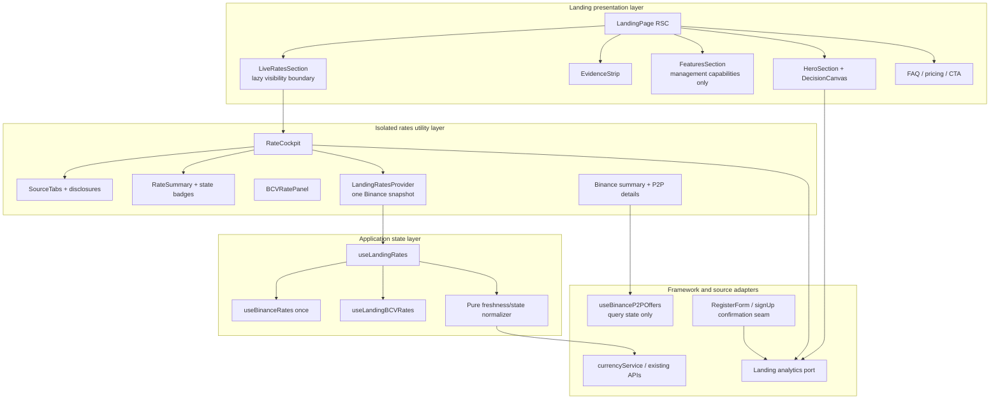

# Design: Landing Revamp

## 0. Resolution and constraints

- **Scope:** design only. No application code, API, scraper, schema, pricing, or authentication behavior is implemented by this phase.
- **Project:** `fintec`; target worktree: `/home/alesierraalta/documents/projects/fintec-worktrees/landing-revamp`.
- **Validated product direction:** finance management first; rates are a secondary utility; the hero uses a decision canvas and a market pulse; evidence is verifiable; data state is explicit; instrumentation precedes conversion optimization.
- **Freshness rule:** the landing specification defines `15 minutes` as the fresh boundary. This is independent from the current global Binance hook's two-hour stale threshold and from the current BCV card's one-hour `isLive` calculation.
- **Skill resolution:** `paths-injected`. The requested `fintec-frontend-design`, `fintec-tailwind-patterns`, `mobile-ux-design`, `frontend-aesthetics`, and `architecture-patterns` skill paths were read before this design.
- **CodeGraph:** the base checkout index was queried for the landing, rate components, hooks, services, and authentication seams. The gateway could not provide an independent worktree index; the target source was then checked with focused reads. The affected call path is recorded below.
- **Context mode:** the MCP gateway returned `MCP not initialized` for `ctx_execute`, `ctx_execute_file`, and `ctx_batch_execute`. The source fallback is documented rather than claiming a context-mode run that did not happen.

The current landing path is:

```text
LandingPage (Server Component)
  -> LandingNav
  -> HeroSection (demo dashboard + BCV/Binance-looking cards)
  -> LiveRatesSection (client lazy boundary)
       -> lazy BCVRates (also calls useBinanceRates)
       -> BinanceRatesComponentWrapper
            -> useBinanceRates (second landing owner)
            -> lazy BinanceRatesComponent
  -> StatsSection (BCV/P2P repeated as trust cards)
  -> FeaturesSection (includes a live-rates feature)
  -> FAQ -> PricingPreview -> CTA -> Footer
```

The design preserves the public Server Component shell and changes the client islands and rate boundary rather than turning the whole landing into one client component.

## 1. Goals and non-goals

### Goals

1. Make the first viewport identify FinTec as a Venezuelan personal-finance product and give one outcome-oriented registration path.
2. Replace repeated rate promises with one discoverable, honest `RateCockpit`.
3. Coordinate Binance data once per landing cockpit visit and pass the same snapshot to every visible consumer.
4. Make loading, fresh, aging, fallback, error, retry, and external-departure states visible and accessible.
5. Keep the rates utility out of the first-render critical path while preserving the existing IntersectionObserver fallback.
6. Remove the iPad false-desktop state by making layout decisions from the cockpit's real width.
7. Establish a privacy-safe, versioned funnel baseline before setting an uplift target.
8. Preserve authenticated rate consumers and the global hook contract unless an additive compatibility field is required.

### Non-goals

- No new Binance scraper, ETH market integration, exchange-rate source, or backend schema.
- No change to Supabase, RLS, pricing, plan permissions, the dashboard, or authentication semantics.
- No fabricated testimonials, user counts, live-looking demo rates, financial forecast, or historical market chart.
- No generic UI library or brand-wide component rewrite.
- No A/B test or percentage conversion claim in the first release.

## 2. Layered architecture

The design applies a small presentation/application/adapter split. The rate-state normalizer is framework-independent; React and analytics remain at the edges.



### Layer responsibilities

| Layer | Responsibility | Must not do |
| --- | --- | --- |
| Landing presentation | Section order, copy, semantic landmarks, static demo composition, CTA destinations | Fetch rates, calculate freshness, call analytics directly, or render duplicate rate claims |
| Rate Cockpit utility | Source selection, summary, progressive disclosure, rate state presentation, P2P handoff | Own a second Binance hook, alter global source semantics, or block the hero |
| Rate state/application | Fetch orchestration for the cockpit, shared snapshots, pure state normalization, retry and freshness clock | Know about marketing copy, analytics vendor APIs, or authenticated screens |
| Source adapters | Existing `currencyService`, `useBinanceRates`, and `useBinanceP2POffers` integration | Leak raw service errors or synthetic timestamps to the UI |
| Measurement port | Versioned allowlisted event payloads, deduplication, fail-open delivery | Accept PII, rate values, P2P form values, or block navigation/rendering |

## 3. New composition and component tree

`LandingPage` remains a Server Component. The new order gives management and evidence priority before the secondary rate tool.

```text
LandingPage (RSC)
├── LandingNav
│   ├── brand
│   ├── desktop navigation
│   └── mobile stacked navigation/actions
├── main
│   ├── HeroSection (RSC)
│   │   ├── FinanceFirstEyebrow (beta is explicit)
│   │   ├── primary TrackedLink -> /auth/register?entry=hero
│   │   ├── secondary TrackedLink -> #tasas-en-vivo
│   │   └── DecisionCanvas (illustrative, labelled Demo)
│   │       ├── MovementNode
│   │       ├── BudgetNode
│   │       ├── DecisionNode
│   │       └── decorative MarketPulse (aria-hidden)
│   ├── EvidenceStrip (replaces StatsSection)
│   │   ├── ProductFact
│   │   ├── ExplicitBoundary
│   │   └── BetaOrPlanFact
│   ├── FeaturesSection
│   │   ├── account/transaction/budget management
│   │   ├── verified security behavior
│   │   ├── adaptable product surface
│   │   └── a distinct management capability
│   │   └── no BCV/P2P rate feature
│   ├── LiveRatesSection (client, lazy shell)
│   │   └── Suspense
│   │       └── RateCockpit
│   │           └── LandingRatesProvider
│   │               ├── CockpitHeader (stacked when narrow)
│   │               ├── RateSummary (selected source + state)
│   │               ├── SourceTabs (BCV / P2P)
│   │               ├── BCVRatePanel (controlled/presentational)
│   │               │   ├── USD/EUR values
│   │               │   ├── optional comparison from shared Binance snapshot
│   │               │   └── converter/trend disclosure
│   │               └── BinanceRatePanel
│   │                   ├── shared Binance P2P summary
│   │                   └── P2POffersDisclosure
│   │                       └── BinanceRatesComponent snapshot={sharedSnapshot}
│   ├── FAQSection
│   ├── PricingPreviewSection (management outcome CTA)
│   └── CTASection (same primary narrative)
└── LandingFooter
```

### Component decisions

- **`HeroSection`:** remove the current BCV and Binance-looking cards. The product mock becomes one decision canvas: movement -> budget -> decision. Any amount or percentage is demo content, visibly labelled, and never described as live or sourced.
- **`EvidenceStrip`:** replace the four `StatsSection` cards. Content is a short list of product facts and boundaries that can be checked against the product, security documentation, plan configuration, or explicit beta status. It must not mention BCV/P2P as stats.
- **`FeaturesSection`:** remove or rewrite `Tasas en Tiempo Real`. The section explains management capabilities, not a second rates surface. Existing data should move from hard-coded blue/purple/orange/yellow classes to semantic FinTec tokens.
- **`RateCockpit`:** one dominant glass surface. The first view contains a summary and source selector; expensive P2P search, converter, comparisons, and trend detail are disclosed after intent.
- **`BCVRatePanel`:** a new controlled/presentational seam extracted from the current `BCVRates` surface. It receives a normalized BCV view model and the shared Binance snapshot for comparison. It must not call `useBinanceRates` in the landing path.
- **`BinanceRatesComponent`:** keep its public `snapshot` prop and make the snapshot visible in the summary. Its existing `useBinanceP2POffers` remains a separate, user-triggered offers query; it is not another rate snapshot owner.
- **`LiveRatesSection`:** retain the file and public export as the lazy shell for a low-risk migration. Its implementation changes from two independent cards to one lazy `RateCockpit`.

## 4. Shared Binance state and rate data flow

### 4.1 One owner per landing visit

The current duplication is structural: `BCVRates` calls `useBinanceRates()` for comparison while `BinanceRatesComponentWrapper` calls `useBinanceRates({ enabled: true })` for the visible Binance card. The new flow is:

```text
LiveRatesSection
  -> RateCockpit / LandingRatesProvider
       -> useBinanceRates({ enabled: true })       // exactly once
       -> useLandingBCVRates({ enabled: true })    // one BCV source owner
       -> normalizeLandingRateState()
       -> context value: { bcv, binance.p2p, binance.eth? }
            ├── RateSummary reads binance.p2p
            ├── BCVRatePanel receives the same binance.p2p for comparison
            └── BinanceRatesComponent receives the same binance.p2p snapshot
                 └── useBinanceP2POffers only when the visitor searches
```

`BCVRates` continues to support existing authenticated callers. It may keep its legacy internal hook path outside the landing, but it is not mounted by the new cockpit. This avoids changing the global `useBinanceRates` semantics just to serve one marketing surface.

The `BinanceRatesSnapshot` contract should receive additive metadata needed by the landing, such as `hasResolved` and `lastFetchError`, while preserving existing `status`, `error`, `isFallback`, `isStale`, and `refetch` behavior for other consumers. The landing adapter must never infer an error solely from a React render or from a current-looking fallback timestamp.

### 4.2 Landing view-model contract

The pure landing state module owns the product-specific 15-minute policy. A source-specific raw response is converted to a view model similar to:

```ts
type LandingRateState = 'loading' | 'fresh' | 'aging' | 'fallback' | 'error';

type LandingRateView = {
  source: 'bcv' | 'binance-p2p' | 'binance-eth';
  value: number | null;
  observedAt: string | null;
  ageSeconds: number | null;
  state: LandingRateState;
  isLive: boolean;
  isFallback: boolean;
  errorMessage: string | null;
  hasValue: boolean;
  retry: () => Promise<void>;
};
```

The actual implementation may use source-specific value types, but it must retain these semantics:

| Input/result | Landing state | Value treatment | `isLive` |
| --- | --- | --- | --- |
| Request pending with no validated result | `loading` | no unqualified number | `false` |
| Valid source timestamp, age `<= 15m`, not fallback | `fresh` | show value, source, age | `true` |
| Valid source timestamp, age `> 15m` | `aging` | retain value with explicit not-fresh label | `false` |
| Missing, invalid, or future timestamp | `aging` (unknown age) | show value only with unknown-age/non-fresh label | `false` |
| Fallback/cache/static recovery | `fallback` | show value only with independent fallback label | `false` |
| Request error without retained value | `error` | no fabricated or unlabeled number; show retry | `false` |
| Request error with retained value | `aging` or `fallback` plus `errorMessage` | retain labelled value and show retry/error | `false` |
| Valid retry response | recompute from new observation | replace prior value/age only after validation | based on state |

Rules:

1. `observedAt` is the source observation timestamp (`lastUpdated`), never render time.
2. Age uses one absolute clock basis. Invalid or future timestamps are unknown and non-fresh.
3. Fallback is orthogonal to freshness. A fallback with a recent-looking generated timestamp remains fallback and never becomes live.
4. `isLive` is derived from the normalized state, not copied from the current BCV component's one-hour flag or the global Binance hook's two-hour flag.
5. A minute-level freshness tick (paused when the document is hidden) updates labels while the cockpit remains mounted. The pure normalizer accepts an injected `now` for deterministic tests.
6. A retry is source-local, keyboard accessible, and does not clear a retained value before a validated replacement exists.

### 4.3 Binance P2P offers are a second state machine, not a second rate owner

The top-level Binance summary uses `LandingRateView`. The offers disclosure keeps the existing `idle | loading | live | empty | stale | unavailable` query state from `useBinanceP2POffers`. Its `fetchedAt` describes an offer search and must not be displayed as the observation time of the rate summary. The disclosure retains:

- the existing public-market warning;
- the amount and payment filters, stacked in narrow containers;
- `Continuar en Binance` as an explicitly external destination;
- loading, empty, unavailable, stale-result, and retry behavior;
- no P2P amount, payment method, merchant, or offer value in analytics payloads.

### 4.4 ETH from Binance: one snapshot and no fabricated source

The current `BinanceRates` type represents USDT/VES P2P values and does not contain an ETH quote. The repository's `crypto-prices-service` explicitly supplies mock prices, so it cannot be used as a live Binance ETH source.

The first launch therefore follows this rule:

- Do not render an ETH financial value as live in the landing.
- Do not call `fetchCryptoPrices` or create a second crypto/rate hook for an ETH card.
- If the product later supplies a verified Binance ETH response, add an optional `eth` projection to the **same** `LandingRatesProvider` snapshot and normalize it with the same `observedAt`, 15-minute, fallback, error, and retry rules. All ETH consumers must receive that one projection.
- A nonnumeric ETH token may appear in the decision canvas only as clearly labelled `Demo` artwork; it is not a source status, quote, or market signal.

This is an intentional trust boundary, not an omission hidden behind a default number.

## 5. Responsive and interaction design

### 5.1 Real-width layout strategy

Viewport breakpoints are insufficient because the cockpit can be narrowed by page padding, a tablet orientation, or a future embedding surface. Use a small `ResizeObserver`-based `useContainerLayout` hook on the cockpit content container:

- default and SSR mode: `stacked`;
- measure the content box, not `window.innerWidth`;
- switch to `split` only when the measured content width is at least `960px` (the initial design token; validate against the viewport matrix before implementation is finalized);
- expose `data-layout="stacked|split"` or a typed layout prop to the source panels;
- if `ResizeObserver` is unavailable, remain stacked rather than guessing;
- use `minmax(0, 1fr)` and `min-w-0` on every grid/flex child;
- do not use `overflow-hidden` to hide an actionable child that is wider than its container.

At `960px` the two readable regions have room for headings, numeric values, warnings, controls, and actions. iPad portrait stays stacked; iPad landscape may split only when the actual content box reaches the threshold. If a future layout reduces the usable width, the observer automatically returns to stacked mode.

The implementation may replace this with native CSS container queries only if the project's Tailwind 3.4 setup gains a documented container-query path without a new runtime dependency. The behavior contract remains the same: actual container width, stacked fallback, and no generic `md` decision.

### 5.2 Phone and iPad rules

- Design from `320px`; audit `320`, `375`, `390`, and `430` CSS pixels plus iPad portrait and landscape.
- Keep the cockpit, hero, evidence, pricing, and footer in a single readable column until sufficient width exists.
- Reduce outer section padding on narrow screens (`px-4` baseline); do not combine large outer padding with another large inner card padding.
- Use one dominant glass surface per major block. Inner rows use separators and flat semantic backgrounds; avoid nested rounded glass cards and accumulated radii.
- Add `min-w-0` to flex/grid content, headings, status groups, offer metadata, and action regions. Allow labels and warnings to wrap.
- Stack cockpit headers and refresh/actions by default. Only place them inline in `split` mode when the measured width permits it.
- Every button, tab, disclosure, retry action, link, and icon-only refresh control is at least `44px` by `44px`.
- Every editable mobile input uses `text-[16px]` or larger to avoid iOS zoom.
- Use `pt-safe-top`, `pb-safe-bottom`, and side safe-area utilities if the nav or any future sticky action becomes fixed. No new fixed surface is required for the first design.
- Use explicit semantic focus rings and active/selected text or icons; state cannot depend on color alone.
- Use an accessible tab pattern: `role="tablist"`, `role="tab"`, `aria-selected`, `aria-controls`, roving/arrow keyboard behavior, Home/End support, and hidden inactive panels that are not focusable.
- External Binance links announce that they open outside FinTec and keep the warning adjacent to the action.
- Honor `prefers-reduced-motion`: disable the canvas pulse and non-essential entrance/hover transforms, avoid animation-dependent state communication, and keep all content available immediately.

## 6. Visual direction

### Editorial glass FinTec

The visual language is a dark, editorial interpretation of the existing iOS-native FinTec glass system:

- Use `glass`, `glass-card`, `glass-light`, semantic `background/card/muted/primary/success/warning/error` tokens, and the existing iOS shadow scale.
- Use one elevated surface per major block, restrained borders, and depth that establishes hierarchy instead of a stack of equally loud cards.
- Keep the page background grid/gradient subtle and decorative; it must never create horizontal overflow.
- Use a display scale (`text-display-*`) for the hero promise and section headlines, with a deliberate display-family token if an approved local brand face exists. Do not add a remote font or a new font dependency only for this landing slice.
- Use `amount-strong`/`font-variant-numeric: tabular-nums` for rates, balances, percentages, and comparison values. Text labels and units remain separate so long VES values can wrap safely.
- Replace hard-coded feature colors with semantic tokens and provide text equivalents for status/action colors.

### Decision canvas and market pulse

The memorable idea is a single line of signal connecting the three decision nodes, not a dashboard full of unrelated panels:

```text
[Movement]  ─── illustrative signal pulse ───>  [Budget]  ───>  [Decision]
    demo                  decorative                       demo
```

The pulse is a short SVG/CSS connector with dots or a soft glow. It is `aria-hidden` when decorative, has no axes, no tooltip, no trend claim, and no historical series. The design must not use Recharts or a financial chart for this artwork. If a textual explanation is needed, it says that the canvas is an illustrative product flow.

Use one orchestrated reveal for the hero and cockpit entrance (`motion-safe` only). Do not scatter independent infinite animations across every card. The signal motif may reappear as a static connector near the Rate Cockpit, but it must not imply that the cockpit value is a charted continuation of the hero demo.

## 7. Analytics contract

The repository currently mounts Vercel Analytics but does not expose a landing-specific, typed event adapter. Add a narrow client-safe port around the existing analytics provider rather than calling a vendor from every component. The adapter must be fail-open and non-blocking.

The requested product shorthand maps to the stable names in the landing specification. Emit the canonical name once; do not emit duplicate aliases.

| Requested shorthand | Canonical emitted event |
| --- | --- |
| `hero_cta_click` | `landing_hero_cta_click` |
| `cockpit_open` | `rate_cockpit_view` |
| `cockpit_tab_select` | `rate_source_select` |
| `rates_error` / `rates_fallback` | `rate_state_change` with `state: "error"` or `state: "fallback"` |
| registration start/complete | `register_start` / `register_complete` |
| `binance_exit_click` | `binance_exit_click` |

Contract version: `landing.v1` (or the repository's equivalent immutable version string once the adapter is named). All payloads are allowlisted and include `contract_version`.

| Canonical event | Emitted when | Required properties | Prohibited properties |
| --- | --- | --- | --- |
| `landing_hero_cta_click` | Primary hero CTA is activated | `cta_id`, `destination`, `contract_version` | email, name, password, account ID, form values |
| `rate_cockpit_view` | Cockpit first becomes actually visible in the page session | `source_default`, `contract_version` | rate value, timestamp-derived age, user ID |
| `rate_source_select` | BCV/P2P tab or source is selected | `source`, `previous_source`, `contract_version` | rate value, P2P form values, user ID |
| `rate_cockpit_interaction` | Detail, converter, or refresh interaction opens/activates | `interaction`, `source`, `contract_version` | amount, payment method, rate value, merchant data |
| `register_start` | First valid registration submit begins, once per form attempt/session entry | `entry_point`, `contract_version` | email, name, password, account ID |
| `register_complete` | `signUp` confirms account creation and the success branch is entered | `entry_point`, `contract_version` | email, name, password, account ID |
| `binance_exit_click` | External Binance action is activated | `source`, `contract_version` | offer values, merchant data, user ID |
| `rate_state_change` | A source changes into loading/fresh/aging/fallback/error after initial render or user action | `source`, `state`, `has_value`, `contract_version` | rate value, raw error, user ID |
| `rate_retry_click` | Source retry is activated | `source`, `contract_version` | rate value, raw request, user ID |

### Emission and registration rules

- `RateCockpit` uses an actual-visibility observer with no positive root margin for `rate_cockpit_view`; the existing positive-margin observer remains only for loading. Without IntersectionObserver, emit the view event once after the fallback mount.
- Event effects compare a stable key/ref before emitting. React re-renders, Suspense resolution, tab panel remounts, and freshness ticks must not inflate counts.
- `landing_hero_cta_click` fires before navigation and is never awaited. Registration links carry an allowlisted `entry` slug (`hero`, `pricing`, `final_cta`, or `direct`) so the auth form does not infer origin from PII or arbitrary query data.
- `RegisterForm` emits `register_start` only after local validation passes and before the first `signUp` call. It emits `register_complete` only after the auth context confirms account creation; a route load or button click alone is not completion. The auth context may add an `accountCreated` result flag without changing the sign-up outcome for existing callers. Email verification remains a separate user-facing step.
- The Binance external link handler emits synchronously/fire-and-forget, then allows the normal `target="_blank"` navigation.
- Analytics delivery failure is swallowed or delegated to the provider's no-op path; it cannot prevent the page, retry, registration, or external navigation from working.
- No raw error strings, rates, timestamps, form fields, offer details, or identifiers enter the event payload.

## 8. File and contract changes

### New files

| File | Responsibility |
| --- | --- |
| `app/(public)/components/evidence-strip.tsx` | Verifiable evidence section replacing `StatsSection`. |
| `app/(public)/components/rate-cockpit.tsx` | Client cockpit orchestration, tabs, summary, disclosures, and shared provider composition. |
| `app/(public)/components/rate-cockpit-skeleton.tsx` | Stable lazy/Suspense placeholder without live-looking values. |
| `hooks/use-landing-rates.ts` | Landing-only source orchestration, freshness clock, retry state, and provider-facing view models. |
| `hooks/use-container-layout.ts` | `ResizeObserver`-based actual-width layout mode with stacked fallback. |
| `lib/rates/landing-rate-state.ts` | Pure 15-minute freshness/fallback/error normalizer and time helpers. |
| `components/currency/bcv-rate-panel.tsx` | Controlled BCV presentation that accepts normalized BCV and shared Binance data. |
| `lib/analytics/landing-events.ts` | Typed, allowlisted, versioned analytics port and safe emitter. |
| `components/analytics/landing-event-link.tsx` | Optional client island for tracking a link without converting static landing sections to client components. |

### Modified files

| File | Planned change |
| --- | --- |
| `app/(public)/components/landing-page.tsx` | Compose Hero -> Evidence -> management Features -> lazy Rate Cockpit -> remaining conversion sections; remove `StatsSection` import. |
| `app/(public)/components/hero-section.tsx` | Replace rate mock with labelled Decision Canvas, finance-first copy, outcome CTA, secondary rates anchor, and market pulse artwork. |
| `app/(public)/components/live-rates-section.tsx` | Keep the lazy boundary and observer fallback; mount one `RateCockpit` instead of two cards/wrappers. Add separate actual-view measurement for analytics. |
| `app/(public)/components/stats-section.tsx` | Retire from composition; delete or keep only as a rollback artifact until the new EvidenceStrip is released. |
| `app/(public)/components/features-section.tsx` | Remove rate feature and use semantic tokens, `min-w-0`, reduced nested surfaces, and reduced-motion classes. |
| `app/(public)/components/data.ts` | Define evidence items and management-only features; preserve empty testimonials and verified-content comments. |
| `components/currency/bcv-rates.tsx` | Extract/reuse presentational pieces without removing the legacy `BCVRates` export or changing authenticated behavior. The landing never mounts its internal Binance hook. |
| `components/currency/binance-rates.tsx` | Render the supplied snapshot summary, honor simple/full disclosure props, pass external-exit and interaction callbacks, and retain the existing P2P offer query contract. |
| `hooks/use-binance-rates.ts` | Add only compatible metadata required to distinguish resolved source errors from fallback recovery; preserve the global two-hour status contract for non-landing callers. |
| `contexts/auth-context.tsx`, `app/auth/register/page.tsx`, `components/auth/register-form.tsx` | Carry an allowlisted entry point and expose/consume an account-created confirmation for `register_start`/`register_complete`; do not change auth or PII handling. |
| `app/(public)/components/landing-nav.tsx` | Stack brand/navigation/actions when the real header width is narrow and maintain 44px controls/safe-area spacing. |
| `app/(public)/components/pricing-preview-section.tsx`, `cta-section.tsx` | Align copy and entry slugs with the management outcome; avoid a second primary-vs-rates decision. |
| `app/globals.css` or a scoped landing stylesheet | Add only missing display/pulse/reduced-motion/container-mode utilities; prefer existing FinTec tokens and animations. |

### Preserved contracts

- Existing `useBinanceP2POffers` request and result types.
- Existing global `useBinanceRates` consumers in accounts, calculator, dashboard, recurring, and payment flows.
- Existing BCV/Binance API, scrapers, fallback sources, and warning text semantics.
- Authenticated `BCVRates` and `BinanceRatesComponent` imports outside the landing.
- `LandingPage` Server Component boundary and unrelated sections' data contracts.

## 9. Alternatives and ADRs

### ADR-001 — One cockpit with progressive disclosure

**Decision:** use one Rate Cockpit with a summary and accessible BCV/P2P tabs/disclosures.

**Alternatives:** two simultaneous cards; remove rates entirely. Two cards preserve comparison but retain the iPad density and positioning problem. Removing rates loses a legitimate secondary intent. The chosen design adds one interaction while removing four repeated promises.

**Trade-off:** expert visitors do not see every P2P detail on first render. The summary still shows the selected source, available value, source, age/state, and next action, and details are one accessible selection away.

### ADR-002 — Provider-owned shared Binance snapshot

**Decision:** one `useBinanceRates` call belongs to `LandingRatesProvider`; all cockpit consumers receive the same snapshot.

**Alternatives:** leave the hook in `BCVRates`; use a global cache/store; make every card fetch independently. The first preserves duplicate ownership, the second broadens scope and cache lifetime, and the third repeats the bug. A local provider has the smallest blast radius and a clear unmount boundary.

**Trade-off:** the landing BCV component needs a controlled/presentational seam instead of its current all-in-one implementation.

### ADR-003 — Actual container width over `md`

**Decision:** use `ResizeObserver` with a `960px` split threshold and stacked fallback.

**Alternatives:** move `md` to `lg`; add a container-query plugin; use viewport-only CSS. A larger viewport breakpoint still fails when the component is embedded or padded; a plugin adds dependency/configuration for one surface; viewport width is not the width available to the cockpit. `ResizeObserver` already has repository precedent and is testable.

**Trade-off:** one client measurement and a layout re-render. SSR remains deterministic because the initial mode is stacked.

### ADR-004 — Landing-specific 15-minute policy

**Decision:** normalize the landing view model at 15 minutes without changing the global hook's two-hour status semantics or the legacy BCV card's one-hour flag.

**Alternatives:** change the shared hook threshold; use the existing `isLive` values; show every timestamp as live. Shared threshold changes risk unrelated screens, existing flags do not meet the specification, and render-time freshness is dishonest.

**Trade-off:** two freshness concepts remain in the repository, but the boundary is explicit and global consumers remain compatible. The specification and tests own the landing threshold.

### ADR-005 — Analytics port, instrument first

**Decision:** add a typed adapter around the existing analytics provider and emit stable intermediate funnel events before any uplift target.

**Alternatives:** direct vendor calls from components; immediate A/B test; final registrations only. Direct calls duplicate policy and encourage PII leakage, the current sample is too small for a useful A/B conclusion, and final counts cannot diagnose cockpit or external-exit behavior.

**Trade-off:** a small adapter and auth seam are required before reporting conversion, but the resulting baseline is actionable and privacy-safe.

### ADR-006 — Glass editorial, not a market dashboard

**Decision:** use a single decision canvas plus decorative signal pulse; never fabricate a financial chart.

**Alternatives:** refine the existing dashboard mock; make a ticker/terminal; use a real-looking chart fed by demo data. Those choices retain catalogue ambiguity, shift the product toward trading, or create a trust problem. The chosen motif explains the product outcome and reserves data density for the real utility.

**Trade-off:** the canvas is less literal than a dashboard, so its `Demo` label and screen-reader explanation are mandatory.

### ADR-007 — ETH is optional in the one Binance snapshot, not a mock live card

**Decision:** do not display a live ETH quote until a verified Binance-backed contract exists. If it becomes available, it is an optional field of the existing shared Binance snapshot, not a second fetch/hook.

**Alternative:** use the existing crypto price service. It is explicitly mock data and would violate the evidence/freshness rules. The chosen decision protects trust and keeps the first change within scope.

**Trade-off:** an ETH requirement may need a follow-up source/API change. That dependency is visible instead of silently producing an invented value.

## 10. Testing and verification strategy

The repository is configured for strict TDD in `openspec/config.yaml`; tests are part of the implementation plan and must be written before the corresponding production changes.

| Area | Behavioral coverage |
| --- | --- |
| Pure state normalizer | Exactly `15m` is fresh; `15m + 1ms` is aging; missing/invalid/future timestamps are unknown-age/non-fresh; fallback never becomes live; `isLive` derives from state; retained-value error exposes retry; error without value shows no number; valid retry replaces the observation. |
| Landing source hook/provider | Initial loading is stable; BCV and Binance retry independently; fallback metadata is preserved; state transitions update as the freshness clock advances; a spy proves one `useBinanceRates` call in the landing cockpit and the same snapshot identity reaches the summary, BCV comparison, and Binance component; no ETH request is issued by the first launch. |
| Rate Cockpit DOM | One cockpit landmark; summary includes source/value/observed-at/age/state/action; BCV/P2P tab roles and selected state; arrow/Home/End keyboard navigation; inactive panels are not focusable; converter and P2P details are disclosed; retained-value error and retry are accessible; external Binance link is announced. |
| P2P query behavior | Existing idle/loading/live/empty/stale/unavailable states remain distinct; search is not triggered merely by selecting a tab; retry uses the last query; offer timestamps are not presented as rate observation timestamps. |
| Analytics adapter | Canonical names and required properties; shorthand mapping does not emit aliases; payloads contain no prohibited fields; adapter failure does not reject UI actions; view/state/interaction events are deduplicated across re-renders, Suspense, and freshness ticks; register start and confirmed completion are separate. |
| Lazy loading | The hero and registration CTA render while the cockpit is outside the near-viewport; the rate chunk/request starts after the loading observer; an undefined `IntersectionObserver` resolves to the same cockpit states; a separate view event occurs only on actual visibility or the documented fallback. |
| Accessibility/motion | Focus-visible behavior, logical heading hierarchy, status text/ARIA association, external-link announcement, `prefers-reduced-motion` disabling non-essential motion, and no focus into hidden tabs. |
| Responsive E2E | Playwright checks `document.documentElement.scrollWidth <= clientWidth` and cockpit `scrollWidth <= clientWidth` at 320/375/390/430, iPad portrait, and iPad landscape. It asserts no overlapping controls and exercises loading, fresh, aging, fallback, and error fixtures. It runs once with `ResizeObserver` absent to verify stacked fallback. |
| Quality gates | Repository formatter, lint, type-check, focused unit/integration suites, relevant no-auth E2E, performance checks, and mutation checks run according to the configured Jest/Playwright lanes. Existing thresholds are not weakened. |

No test should call the live Binance or BCV service. Source responses, clock time, visibility, analytics, and observer availability are injected or mocked.

## 11. Migration, rollout, and rollback

### Migration sequence

1. Add the pure rate-state contract and tests, then the landing source/provider seam and one-owner test.
2. Add the analytics port and auth confirmation seam with payload tests; keep the adapter fail-open and disabled/no-op when the provider is unavailable.
3. Build the static `DecisionCanvas`, `EvidenceStrip`, and management-only feature data without mounting live rates.
4. Replace the `LiveRatesSection` interior with the lazy `RateCockpit`; keep the old `BCVRates` export and old composition available in the branch until the cockpit passes the viewport/state matrix.
5. Validate the new hero/evidence/cockpit path in staging and confirm event delivery, deduplication, no PII, and no first-render rate dependency.
6. Release as the default composition. Establish an event baseline before discussing conversion uplift; the previous `22 visits / 0 conversions` sample is not a statistical target.

No database migration, API deployment, scraper change, or coordinated backend rollout is required.

### Lazy-loading and observer fallback

`LiveRatesSection` keeps the current `IntersectionObserver` strategy (`rootMargin: 300px 0px`, small threshold) for chunk/data loading. Before the observer fires it renders a neutral skeleton with no numeric value. If the browser lacks `IntersectionObserver`, it sets `shouldLoadLiveRates` immediately and the same `loading -> resolved/fallback/error` state machine is available. The actual-view observer used for analytics is separate so prefetching near the viewport does not count as a view.

The cockpit itself may defer the full P2P offer explorer until the P2P tab/detail disclosure opens. That optimization must not defer the summary state or the retry control after the cockpit is loaded.

### Rollback

- **Whole landing regression:** restore the `LandingPage` import/order and old hero/stats composition in one revert. Keep the new pure tests and adapter isolated; they do not affect unrelated routes.
- **Cockpit-only regression:** temporarily render the cockpit in `stacked` mode for all widths or restore the prior lazy section behind the same composition boundary. Do not restore the duplicate Binance owner as the long-term fix.
- **Data-state regression:** disable the landing provider's enhanced presentation and show a retryable neutral state; never fall back to an unlabeled live-looking number.
- **Analytics regression:** switch the adapter to its no-op path or remove event callbacks. Navigation, registration, retry, and Binance departure must continue regardless of delivery.
- **Conversion/copy regression:** revert only hero/evidence/CTA copy and entry slugs without changing rate sources or authenticated screens.
- **ETH/source issue:** omit the ETH projection and keep the labelled demo/non-numeric treatment until a verified source contract is delivered.

Because there is no schema or API contract migration, rollback is a composition/code revert rather than a data restoration operation.

## 12. Acceptance guardrails for implementation

Implementation is ready to start only when it preserves these invariants:

1. There is exactly one visible Rate Cockpit and no BCV/P2P rate cards in Hero, EvidenceStrip, or Features.
2. The landing cockpit has one `useBinanceRates` owner; the BCV comparison and Binance details consume the same snapshot.
3. `fresh` means a valid source observation no older than 15 minutes; `isLive` is false for aging, fallback, unknown-age, loading, and error states.
4. Error and fallback labels are independent, retained values remain qualified, and retry is actionable.
5. The hero's canvas and pulse are explicitly demo/decorative and never look like a live financial chart.
6. The cockpit stays stacked in iPad portrait and switches only from its real measured width; all relevant children use `min-w-0`.
7. Controls are at least 44px, mobile inputs are at least 16px, headers stack when narrow, and reduced motion preserves comprehension.
8. Event names and payloads match `landing.v1`, contain no PII or rate/form values, and do not duplicate on re-render.
9. Registration completion is tied to confirmed account creation, not a click or route load.
10. Lazy loading and its no-observer fallback preserve a usable primary registration path.
